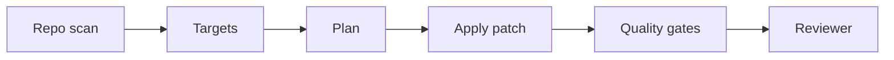

# 04 - Autonomous Refactor Agent

[](https://github.com/milos-plavsic/autonomous-refactor-agent/actions/workflows/ci.yml)
[](https://www.python.org/downloads/)

A repository-aware coding agent that proposes safe refactors, generates patch plans, executes tests, and prepares PR-ready change summaries.

## Quickstart

```bash
make install
make run
make api
make test
```

Docker API: `make docker-api`.

## API

- OpenAPI docs: `http://127.0.0.1:8000/docs`
- Health: `GET /health`
- Analyze: `POST /v1/refactor/analyze` with JSON body `{"target_path":"..."}`

## Architecture



## Why This Project Stands Out

- Connects AI planning with software quality gates.
- Demonstrates practical agent use in developer workflows.
- Clear engineering value and measurable outcomes.

## Core Capabilities

- Code smell and complexity scan.
- Refactor plan generation with risk labeling.
- Patch generation with scoped file edits.
- Automatic lint/test execution before acceptance.
- Reviewer-agent that challenges risky changes.

## Suggested Tech Stack

- Python 3.11+
- `tree-sitter` / static analysis libs, `pytest`, `ruff`, `mypy`, `langgraph`
- Optional GitHub integration via `gh` API

## Architecture (Graph)

`repo_scan -> prioritize_targets -> plan_refactor -> apply_patch -> run_quality_gates -> reviewer_agent -> finalize_or_rollback`

## Usage Suggestions

- Restrict refactor scope by module for safer early demos.
- Require all tests passing before generating PR output.
- Store decision logs so reviewers can inspect rationale.

## Portfolio Additions

- Before/after complexity and duplication metrics.
- PR report with "risk score" and impacted modules.
- Optional dry-run mode to simulate changes safely.

## Milestones

- `v0.1`: scan + proposal report only.
- `v0.2`: patch generation with local validation.
- `v0.3`: reviewer agent and rollback handling.
- `v1.0`: automated PR creation pipeline.

## Demo Scenarios

1. Split a monolithic utility module into cohesive files.
2. Replace repeated validation logic with shared abstractions.
3. Upgrade API handler patterns across a service package.
