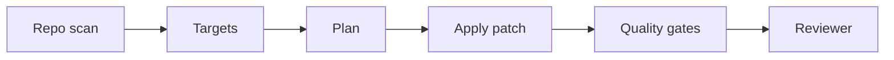

# 04 - Autonomous Refactor Agent

[](https://github.com/milos-plavsic/autonomous-refactor-agent/actions/workflows/ci.yml)
[](https://www.python.org/downloads/)

A repository-aware coding agent that proposes safe refactors, generates patch plans, executes tests, and prepares PR-ready change summaries.

## Quickstart

```bash
make install
make run
make api
make test
```

Docker API: `make docker-api`.

## API

- OpenAPI docs: `http://127.0.0.1:8000/docs`
- Health: `GET /health`
- Analyze: `POST /v1/refactor/analyze` with JSON body `{"target_path":"..."}`
- Patch simulation: `POST /v1/apply/simulate`
- PR export: `POST /v1/pr-draft` (requires `GITHUB_TOKEN` and `gh` CLI)
- Branch protection guide: `docs/BRANCH_PROTECTION.md`

## Architecture



## Core Capabilities

- Code smell and complexity scan.
- Refactor plan generation with risk labeling.
- Patch generation with scoped file edits.
- Automatic lint/test execution before acceptance.
- Reviewer-agent that challenges risky changes.

## Architecture (Graph)

`repo_scan -> prioritize_targets -> plan_refactor -> apply_patch -> run_quality_gates -> reviewer_agent -> finalize_or_rollback`
